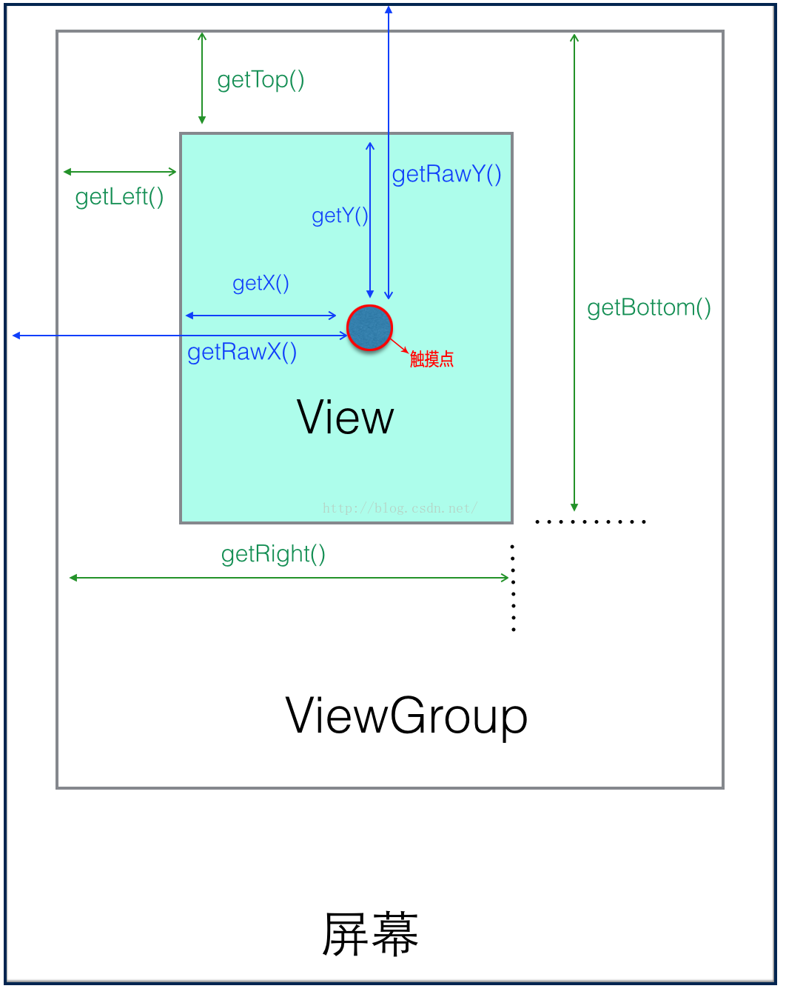

# android之好记性不如烂笔头

> icon 尺寸：

文件夹              |   尺寸
------              |:------:
mipmap-mdpi         |48x48
mipmap-hdpi         |72x72
mipmap-xhdpi        |96x96
mipmap-xxhdpi       |144x144
mipmap-xxxhdpi      |192x192

> Bitmap

```
public static int[] getImageWidthHeight(String path){
    BitmapFactory.Options options = new BitmapFactory.Options();

    /**
     * 最关键在此，把options.inJustDecodeBounds = true;
     * 这里再decodeFile()，返回的bitmap为空，但此时调用options.outHeight时，已经包含了图片的高了
     */
    options.inJustDecodeBounds = true;
    Bitmap bitmap = BitmapFactory.decodeFile(path, options); // 此时返回的bitmap为null
    /**
     *options.outHeight为原始图片的高
     */
    return new int[]{options.outWidth,options.outHeight};
}
```

[新增view（addView()）后，之前的控件位置被重置](https://www.jianshu.com/p/c73bd8e30ffa)
在拖拽view1的时候，要重新对view1的布局参数进行设置，如下
```
RelativeLayout.LayoutParams layoutParams = (LayoutParams) view1.getLayoutParams();
  layoutParams.leftMargin = view1.getLeft();
  layoutParams.topMargin = view1.getTop();
  view1.setLayoutParams(layoutParams);
```

[各种坐标](https://blog.csdn.net/afei__/article/details/51674519)
- View获取坐标的方法有：  
  getTop：获取到的，是view自身的顶边到其父布局顶边的距离  
  getLeft：获取到的，是view自身的左边到其父布局左边的距离  
  getRight：获取到的，是view自身的右边到其父布局左边的距离  
  getBottom：获取到的，是view自身的底边到其父布局顶边的距离  

- MotionEvent获取坐标的方法有：  
  getX()：获取点击事件相对控件左边的x轴坐标，即点击事件距离控件左边的距离  
  getY()：获取点击事件相对控件顶边的y轴坐标，即点击事件距离控件顶边的距离  
  getRawX()：获取点击事件相对整个屏幕左边的x轴坐标，即点击事件距离整个屏幕左边的距离  
  getRawY()：获取点击事件相对整个屏幕顶边的y轴坐标，即点击事件距离整个屏幕顶边的距离  
 

> 真实位置的改变  
```
    offsetLeftAndRight、offsetTopAndButtom  
    view.setLeft(left)、view.setRight(right)（属性动画同理）  
    LayoutParams  
    ViewDragHelper 
```

