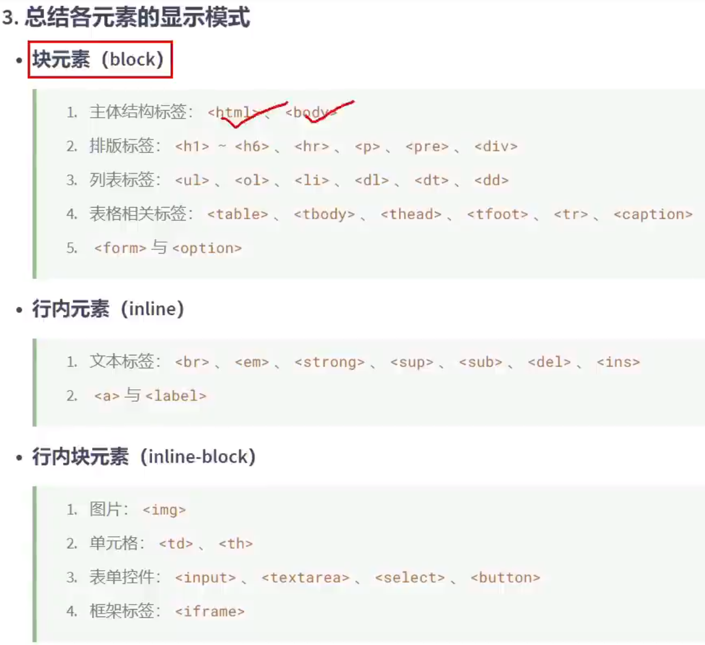
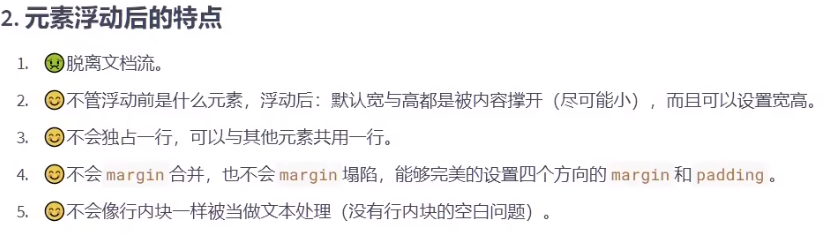

# Css

#### 语法：

> 位置

- 内联样式：

```
<div style="color: fuchsia"></div>
```

- style标签内：

```
<style>
  p{
  color: blue;
  }
  </style>
```

- 外部：

```
<link rel="stylesheet" href="cssImport.css">
```
> 基本语法
- 选择器 声明块
- 通配选择器 *{}
- 元素选择器 p{} h1{} div{}等
- id选择器 #id{}
- class选择器 .class{}
- 复合选择器 
  - 交集选择器 选择器之间紧挨着 div.class .class.class{}
  - 并集选择器(分组选择器) 选择器之间用逗号隔开 示例：div,span,class,class,....{}
- 关系选择器
  - 后代选择器 祖与后代直接加空格 示例：祖 后代{}   混合使用：祖 后代交集{} 示例：div p.class{} 
  - 子代选择器 父>子{}
  - 兄弟选择器 兄+弟 下一个兄弟 兄~弟 下边的所有兄弟
  - 属性选择器 
    - \[属性]{} 
    - \[属性=\"属性值\"]
    - \[属性^=\"属性值\"]
    - \[属性$=\"属性值\"]
    - \[属性*=\"属性值\"]
  - 伪类选择器 标签：状态{} 注意顺序
    - 结构伪类 标签：first-child{} 全部 示例:div:first-child{}
    - 结构伪类 标签：last-child{}
    - 结构伪类 标签：nth-child(5){} 括号了是an+b 比如是前五个 -n+5
    - 结构伪类 标签：first-of-type{} 全部同类型
    - 结构伪类 标签：last-of-type{}
    - 结构伪类 标签：nth-of-type(5){} 括号了是an+b 比如是前五个 -n+5
    - 否定伪类 标签：not() 除括号里其他标签 括号里可以是其他选择器
    - UI伪类 标签：checked{} 示例：input：disabled{}、input:enabled{}、input:checked{}
    - 目标伪类 标签：target{}
    - 语言伪类 标签：lang{}
  - 伪元素选择器 标签::特殊位置
    - div::first-letter{} 第一个元素
    - div::first-line{} 第一行
    - div::selection{} 选中的文字
    - input::placeholder{} 提示语
    - p::before{ content: "￥"} 前边
    - p::after{content: ".00"} 后边
  - 优先级：id选择器 > 类选择器 > 元素选择器 > 通配选择器 （越精准越高）
  - a:ID 选择器的个数
  - b:类、伪类、属性 选择器的个数
  - c:元素、伪元素 选择器的个数
  - （a、b、c）相应比较
  - !important 最牛逼
- 单位
  - px (像素)
  - em (相当于当前元素的font-size的倍数)
  - rem (相当于根元素的font-size的倍数)
  - % (相当于父元素的百分比)
- 元素的显示模式
  - 块元素
    - 独占一行
    - 默认宽度：撑满父元素。
    - 默认高度：有内容撑开。
    - 可以通过css设置宽高。
  - 行内元素
    - 不独占一行
    - 默认宽度：有内容撑开。
    - 默认高度：有内容撑开。
    - 无法通过css设置宽高。
  - 行内块元素（内联块元素）
    - 不独占一行
    - 默认宽度：有内容撑开。
    - 默认高度：有内容撑开。
    - 可以通过css设置宽高。
  - 修改元素显示模式 display:block、inline、inline-block;
  - 
- 盒子模型：
  - content区域 padding border
  - margin 
  - 
  - 
  - 
  - display: none 隐藏不占位   visibility: hidden 隐藏占位
  - 
  - 
  - 
  - 
- 浮动 float
  - 
  - 
  - 